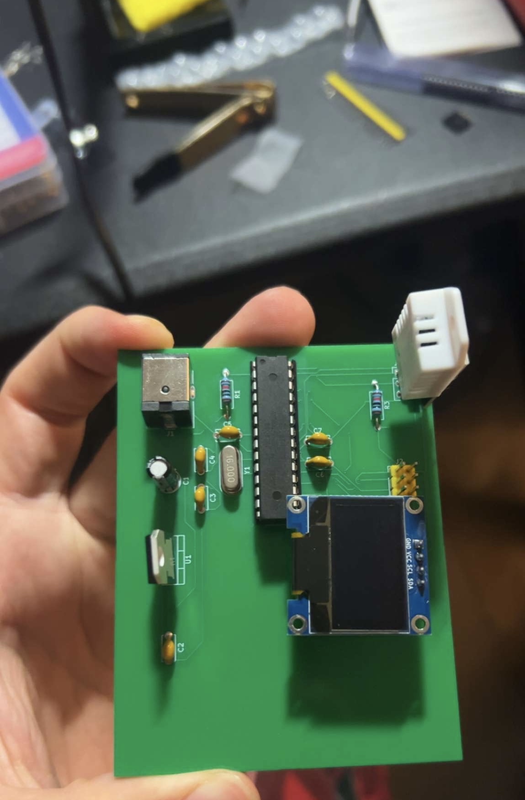
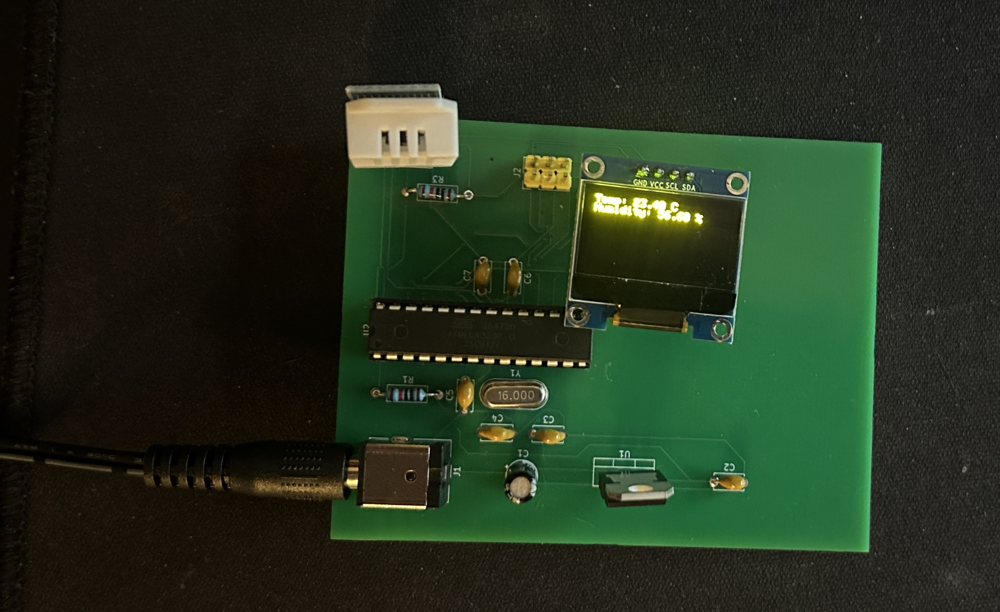

# PCB Environmental Sensor Node

A custom-fabricated, two-layer PCB built around an ATmega328P microcontroller that reads live temperature and humidity data from a DHT22 sensor and displays it on an SSD1306 OLED over I2C.

This is Project 3 of a self-directed summer hardware roadmap (see the [main roadmap](../README.md) for Projects 1 and 2) — three ground-up analog and embedded builds completed June–September 2026 to prepare for co-op interviews.



## Overview

| | |
|---|---|
| **MCU** | ATmega328P-PU (DIP-28, socketed) |
| **Sensor** | DHT22 (temperature + humidity) |
| **Display** | SSD1306 128×64 OLED (I2C) |
| **Power** | 9V barrel jack → L7805 linear regulator → 5V rail |
| **Clock** | 16MHz external crystal |
| **Programming** | ISP via 6-pin AVR-ISP header (Arduino as ISP) |
| **Fabrication** | JLCPCB, 2-layer, 70×90mm, FR-4, HASL |
| **Design tool** | KiCad |

## Features

- Reads temperature and humidity from a DHT22 every 2 seconds
- Displays live sensor readings on an onboard OLED via I2C
- Fully self-contained once flashed — no dependency on a host computer or programmer board during normal operation
- ATmega328P is socketed (not soldered direct), so the chip can be pulled and reprogrammed or swapped

## Repo contents

```
firmware/           Arduino sketch (DHT22 + OLED sensor loop)
kicad/               Schematic + PCB layout source files
gerbers/             Fabrication files as submitted to JLCPCB
images/              Build photos, schematic screenshots
```

## Build process

1. **Schematic design (KiCad)** — power regulation (barrel jack → L7805 → decoupling), 16MHz crystal oscillator with load caps, ATmega328P with ICSP header, DHT22 with pull-up resistor, SSD1306 OLED on I2C. ERC/DRC clean with zero errors.
2. **PCB layout** — zone-based placement (power stage / MCU + crystal / edge I/O), full 2-layer routing with vias, net-by-net verification against physical module silkscreens before routing.
3. **Fabrication** — Gerbers generated and submitted to JLCPCB.
4. **Assembly** — hand-soldered all components: DIP-28 socket, crystal, ceramic and electrolytic caps, resistors, ICSP header, voltage regulator, barrel jack, DHT22, and OLED.
5. **Bring-up** — visual inspection and continuity testing before first power-on; confirmed 5V rail with the ATmega socket empty before seating the chip.
6. **Programming** — flashed via Arduino-as-ISP (Elegoo Uno running the ArduinoISP sketch, wired to the board's 6-pin ICSP header).

## v1 → v2 design fixes

An initial board revision (v1) was fabricated and used as a practice/verification board before the final order:

- **DC barrel jack footprint** was rotated inward relative to the board edge — corrected in v2's layout.
- **AREF was incorrectly tied directly to the +5V rail.** Fixed in v2 to route AREF through a GND-side decoupling cap only, avoiding potential damage if `analogReference(INTERNAL)` is ever called in firmware.

## Debugging notes

The most interesting issue during bring-up wasn't a soldering defect — it was a firmware/configuration problem that looked like a wiring problem.

**Symptom:** ISP programming repeatedly failed with sync errors (`protocol expects OK byte 0x10 but got 0x14`). Wiring, continuity, and power all checked out clean.

**Diagnosis:** Uploaded a simple Blink sketch via ISP and timed it — the LED blinked roughly 8x slower than the coded 1-second delay. This indicated the ATmega328P was running on its internal 8MHz oscillator (further divided by the default CKDIV8 fuse, to ~1MHz) rather than the board's external 16MHz crystal.

**Fix:** Ran `Tools → Burn Bootloader` over the existing ISP connection (Board: Arduino Uno, Programmer: Arduino as ISP) to rewrite the fuse bits for the external crystal, then reflashed the sensor firmware.

**Why this mattered specifically for the DHT22:** I2C (used by the OLED) tolerates a fair amount of clock deviation and worked fine even at the wrong speed. The DHT22 protocol, by contrast, is bit-banged with strict microsecond-level pulse timing — running at the wrong clock silently broke it, returning `NaN` on every read even though the rest of the board appeared to work correctly. This made the DHT22-only failure a strong clue pointing at timing rather than wiring.

A secondary issue encountered along the way: newer Arduino IDE versions auto-reset the Uno on connection, which interrupts ArduinoISP mid-handshake. Fixed with a 10µF capacitor between the Uno's physical RESET pin and GND during programming (removed when re-flashing ArduinoISP itself onto the Uno, since it blocks that upload too).

## Known limitation / future revision

The OLED footprint (J4) didn't leave clearance for the display to sit flush while keeping the ATmega socket-removable — the display module's physical footprint is larger than its 4-pin connector suggested. Solved for this board by directly soldering the OLED at a slight angle to clear the socket. A cleaner fix for a future revision: elevate the OLED on female header standoffs, or shift the J4 footprint further from the IC socket in layout.

## Results

Confirmed stable live readings on the assembled board: ~24.5°C, ~52–53% relative humidity.


